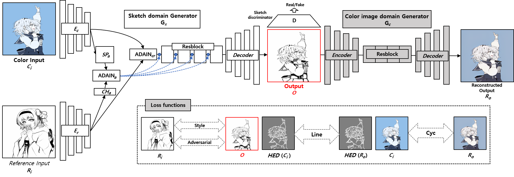
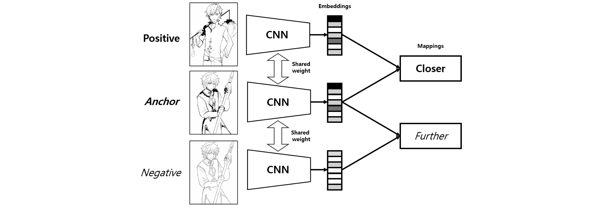

# Greyscale Image Processor (Sketch Generator)

This repository takes an image as input and outputs a greyscale "sketch" of the image. It provides a web-based HTML endpoint for easy testing.

## Features
- Upload an image via the web interface.
- Converts the image to a greyscale sketch.
- Downloads processed images as a ZIP file.
- Gpu docker container setup
- PreFlask endpoint setup

# Architecture



# Inputs and Outputs for Flask-endpoint
##Input
 - Image File: Upload an image file (.png).
#Output
- ZIP File: A downloadable ZIP file containing the generated sketch.
- Greyscale Sketch: Zip contains a processed greyscale version of the input image.

## Source
This repository is a clone of [https://github.com/Chanuku/semi_ref2sketch_code](https://github.com/Chanuku/semi_ref2sketch_code).


## How to Run

### 1. Clone the Repository
```bash
git clone <repository-url>
cd <repository-name>

# Set Up a Python Environment
Run Docker Container:
- pip install -r requirements.txt
- docker build -t img2skch .
- docker run --gpus all -p 5000:5000 -it img2skch
